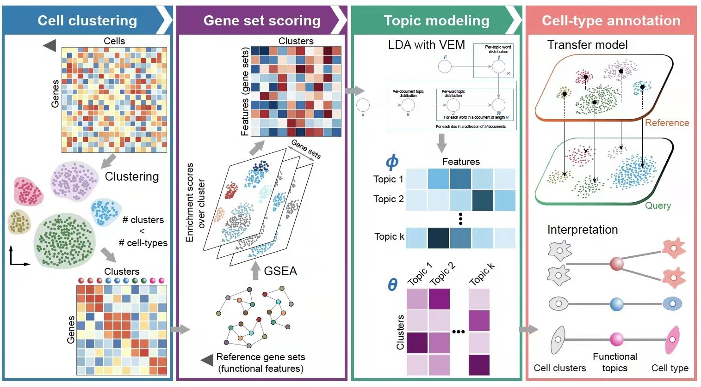

# CellFunTopic

<!-- badges: start -->
<!-- badges: end -->

Cell-Type Inference and Functional Annotation for Single-Cell Transcriptomics Using Functional Signatures.


CellFunTopic enables rapid, automated, effective cell type annotation transfer across datasets and species. In addition, CellFunTopic provides a variety of meaningful visualization methods for functional annotation of single-cell transcriptomics, most of which can be explored interactively in the built-in shiny app.





## Installation

First, install devtools (for installing GitHub packages) if it isn’t already installed:

``` r
if (!requireNamespace("devtools", quietly = TRUE)) install.packages("devtools")
```

Then, install CellFunTopic:

``` r
devtools::install_github("compbioNJU/CellFunTopic")
```

## Example

Please see website: https://compbioNJU.github.io/CellFunTopic


